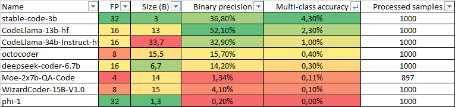

# Jupyter Notebooks

## Setting up the environment 

For the project to work correctly, you must install the following components:
1) [Python 3.10](https://www.python.org/downloads/release/python-3100/);
2) [CUDA Toolkit 12.4 (Version 11)](https://developer.nvidia.com/cuda-downloads?target_os=Windows&target_arch=x86_64&target_version=11&target_type=exe_network);
3) [cuDNN 9.0.0 (Version 10)](https://developer.nvidia.com/cudnn-downloads?target_os=Windows&target_arch=x86_64&target_version=10&target_type=exe_local).

[This laptop](notebooks/setup_lib.ipynb) will help you install all the necessary libraries.

All models are saved along the path: `C:\Users\<user name>\.cache\huggingface\hub`

## Models to be tested

- [stabilityai/stable-code-3b](https://huggingface.co/stabilityai/stable-code-3b)
- [bigcode/octocoder](https://huggingface.co/bigcode/octocoder)
- [deepseek-ai/deepseek-coder-6.7b-instruct](https://huggingface.co/deepseek-ai/deepseek-coder-6.7b-instruct)
- [WizardLM/WizardCoder-15B-V1.0](https://huggingface.co/WizardLM/WizardCoder-15B-V1.0)
- [nextai-team / Moe-2x7b-QA-Code](https://huggingface.co/nextai-team/Moe-2x7b-QA-Code)
- [microsoft/phi-1](https://huggingface.co/microsoft/phi-1)

## Data collection and processing

- [This laptop](notebooks/local_run_llm.ipynb) will help you collect the results of the model’s responses to the samples provided to it into one JSON file. The results of the answers can be found along the path `..\data\collected_generated_text`
- You can process the collected model results using [this laptop](notebooks/local_run_llm.ipynb). The output will summarize the final accuracy of the model's responses.

## Features of launching models

Due to the lack of infinite video memory, the tests had to resort to quantization of models, which made the final results not entirely reliable.

## Test results

All models performed poorly on multi-class classification, showing results of less than 5%.

The best result of binary classification was demonstrated by the stabilityai/stable-code-3b model. But it’s hard to call it a success. It seems that this model was throwing out conclusions absolutely randomly, and it is difficult to trust its results.

It is noteworthy to note that all models exhibit hallucination in one manner or another. The models claim that there are no vulnerabilities in the code, but then indicate the CWE ID in the same response.